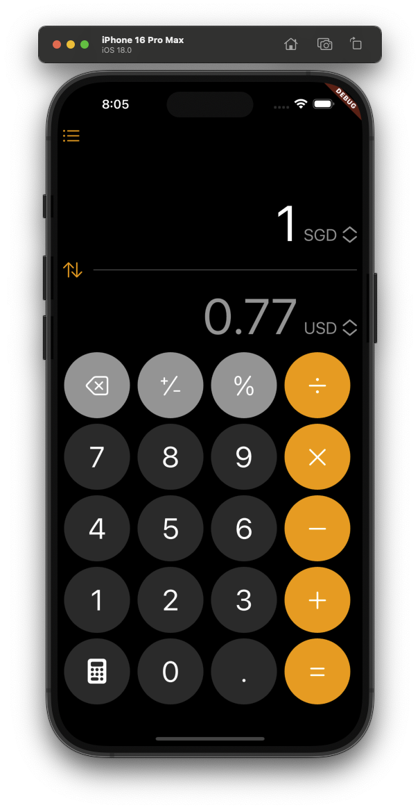

# Flutter iOS Calculator

A simple and intuitive Flutter application for foreign exchange calculations, featuring the latest iOS 18 calculator UI design.

This app allows users to convert between different currencies using real-time exchange rates fetched from [Free Currency API](https://freecurrencyapi.com).

## Features

- **User-Friendly Interface**: Mimics the iOS 18 calculator UI for a familiar experience.
- **Real-Time Conversion**: Fetches the latest currency conversion rates via API.
- **Two Currency Display**: Easily toggle between two currencies and input amounts.
- **Modal Currency Selection**: Use a modal bottom sheet for selecting different currencies.
- **Error Handling**: Proper error handling for API requests.

## Screenshots



## Getting Started

To run this application, you need to have Flutter installed on your machine. Follow the instructions below to set up your development environment.

### Prerequisites

- [Flutter/Dart SDK](https://docs.flutter.dev/get-started/install)
- An IDE such as [Visual Studio Code](https://code.visualstudio.com/) or [Android Studio](https://developer.android.com/studio)
- [Free Currency API](https://freecurrencyapi.com) account for API key
- iOS/Android Emulator or physical device for testing

### Installation

1. Clone the repository:

```bash {"id":"01J9E90V4WZXEB4W5TQWNM3E7N"}
git clone https://github.com/grandnexus/flutter-ios-calculator.git
cd flutter-ios-calculator
```

2. Install the required dependencies:

```bash {"id":"01J9E90V4WZXEB4W5TQXTF4HKF"}
flutter pub get
```

3. Set up your API key for Free Currency API:

- Create an `secrets.json` file in the root directory and add your API key:

```plaintext {"id":"01J9E90V4WZXEB4W5TQYZR6HMG"}
{
    "CURRENCY_API_KEY": "your_api_key_here"
}
```

4. Run the application:

```bash {"id":"01J9E90V4WZXEB4W5TR00BW6ZS"}
flutter run
```

5. Test the application:

```bash {"id":"01J9EAK76Z12XW27B1TNMCMWPE"}
flutter test
```

## Code Structure

- `lib/`: Contains the main application code.
   - `models/`: Contains model classes for handling currency data.
   - `utils/`: Utility functions and helpers for converting different currencies.
   - `widgets/`: Custom widgets for the calculator UI.
   - `main.dart`: Entry point of the application.

### Key Classes

- `models`
   - `Currency`: A model class representing a currency.
   - `CurrenciesData`: A model class representing a currencies data from the API.

- `pages`
   - `CalculatorPage`: The main page that displays the currency calculator.

- `utils`
   - `Converter`: A service class for fetching exchange rates and performing currency conversions.

- `widgets`
   - `CircularButton`: A custom circular button widget.
   - `CurrencyButton`: A custom button widget for selecting a currency.
   - `ModalListBottomSheet`: A custom modal bottom sheet for selecting a currency.
   - `ToggleButton`: A custom toggle button widget for switching between currencies.

- `MyApp`: The main application widget.

## Usage

To use the calculator:

1. Select the currencies you want to convert using the buttons next to the amount fields.
2. Input the amount you wish to convert in either the top or bottom currency field.
3. The converted amount will automatically display in the corresponding field.

## API Reference

### Fetching Currencies

```dart {"id":"01J9E90V4WZXEB4W5TR0AVNW7W"}
static Future<Map<String, Currency>> fetchCurrencies({ http.Client? mockClient });
```

### Fetching Latest Exchange Rates

```dart {"id":"01J9E90V4WZXEB4W5TR26JJP72"}
static Future<Converter> fetchLatest(String baseCurrency, String targetCurrency, { http.Client? mockClient });
```

### Currency Conversion

```dart {"id":"01J9E90V4WZXEB4W5TR3B9KRBJ"}
double convert(double amount);
```

## Flutter Packages Used

### Dependencies

- **flutter**: The Flutter SDK. [pub.dev](https://pub.dev/packages/flutter)
- __cupertino_icons__: ^1.0.8 - Provides icons for iOS style applications. [pub.dev](https://pub.dev/packages/cupertino_icons)
- **http**: ^1.2.2 - A package for making HTTP requests. [pub.dev](https://pub.dev/packages/http)
- __auto_size_text__: ^3.0.0 - Automatically resizes text to fit within its bounds. [pub.dev](https://pub.dev/packages/auto_size_text)
- __font_awesome_flutter__: ^10.7.0 - FontAwesome icons for Flutter. [pub.dev](https://pub.dev/packages/font_awesome_flutter)
- __modal_bottom_sheet__: ^3.0.0 - A package for displaying modal bottom sheets. [pub.dev](https://pub.dev/packages/modal_bottom_sheet)

### Dev Dependencies

- __flutter_test__: The Flutter testing framework. [pub.dev](https://pub.dev/packages/flutter_test)
- __flutter_lints__: ^4.0.0 - A set of recommended lints for Flutter projects. [pub.dev](https://pub.dev/packages/flutter_lints)
- **mockito**: ^5.4.4 - A package for creating mock objects in tests. [pub.dev](https://pub.dev/packages/mockito)
- __build_runner__: ^2.4.13 - A tool for building Dart code. [pub.dev](https://pub.dev/packages/build_runner)

## Contributing

Contributions are welcome! Please open an issue or submit a pull request if you'd like to contribute to this project.

## License

This project is licensed under the BSD 2-Clause License. See the [LICENSE](LICENSE) file for more details.

## Acknowledgements

- [Free Currency API](https://api.freecurrencyapi.com) for providing real-time exchange rates.
- [App Icon Generator](https://appicon.co) for creating the application icon.
- Flutter team for creating an amazing framework.
- This project uses the SF Pro Display font, designed by Apple Inc. SF Pro Display is a versatile typeface that enhances the user experience with its clean and modern aesthetic. The font is available under the Apple Font License. For more information, visit Apple's official typography page.
